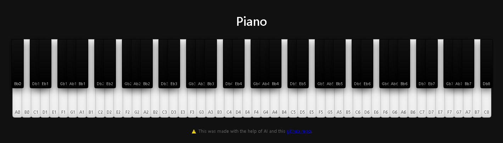

# Piano
Simple virtual piano to play anywhere.
```
+-------------------------------+
|                               |
|   ____  _                     |
|  |  _ \(_) __ _ _ __   ___    |
|  | |_) | |/ _` | '_ \ / _ \   |
|  |  __/| | (_| | | | | (_) |  |
|  |_|   |_|\__,_|_| |_|\___/   |
|                               |
+-------------------------------+
```
# Preview Link:
[https://adnans.website/archive/#piano](https://adnans.website/archive/#piano)
# Preview Image:



## License
This project is provided as-is under the MIT License.

> **Note**: ⭐ Give this Repository a star if you found it helpful :>